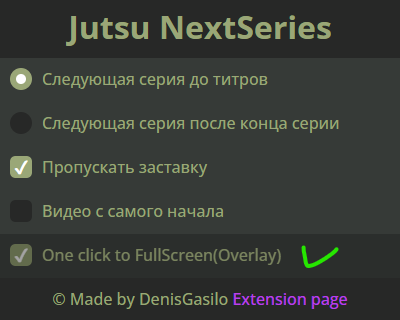

# Watch jut.su

Work in pairs with my [Chrome extension](https://github.com/DenisGas/jut.su_next-series) and opens jut.su video in fullscreen

❗ Works only on Windows PC.

## I use 

python -v 3.11

selenium -v 4.9.1

---

## Install

You need install python, selenium web driver

[python download](https://www.python.org/downloads/)

After installing python

---

In cmd 

```cmd
pip install -U selenium
```

## Use

you need to open main.py -
If you did everything right, it will start and open jut.su

in extension "jut.su_next-series" you need **ON** checkbox to "One click to FullScreen(Overlay)"




## Preview


